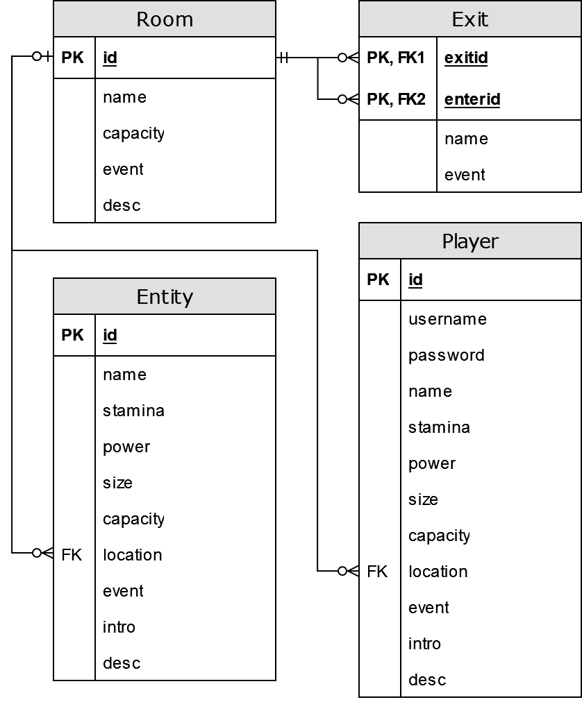

# Travelermud
The skeleton for my very own Multi User Dimension. This is the current 
living, work in progress branch of the game. It uses a local SQLite database 
for transactional changes to the game state.

## Work in Progress
- The Game object, which is central, including:
- SQLite database schema
- Design of game ideas through database entities

## Entity Overview
### Rooms
- id -- integer, not null, unique, primary key
- name -- text, not null
- capacity -- integer, not null, default -1
- event -- text
- desc -- text, not null

Outermost thing that stores Entities, including Player Entities. Adjacency 
determined by Exits. The Event tied to a Room is applied once to an Entity 
when they enter it.

### Exits
- exitid -- integer, not null
- name -- text, not null
- enterid -- integer, not null
- event -- text
- foreign key(enterid) references Room(id)
- foreign key(exitid) references Room(id)
- unique (enterid, name)

Connects Rooms together. Name determines the argument players type when 
moving to use it. The Event tied to an Exit is applied to an Entity once 
when they use it.

### Entities
- id -- integer, not null, unique, primary key
- name -- text, not null
- stamina -- integer
- power -- integer, not null, default 0
- size -- integer, not null, default 0
- capacity -- integer, not null, default 0
- location -- integer
- event -- text
- intro -- text, not null
- desc -- text, not null
- foreign key(location) references Room(id)

Data wrappers for all in-game objects, monsters, containers, and players. 
Location determines which Room or Entity the Entity is "inside".
Size determines how much capacity an Entity takes up when inside that entity.
Capacity is how much size an Entity can have inside it. Thus, all the usual 
types of objects in games are abstracted into Entities. The Event tied to an 
Entity is the one that determines its action. For Player Entities this is 
the parse function, which takes client input, affects the world database, 
and returns client output.

### Players
- id -- integer, not null, unique, primary key
- username -- text, not null, unique
- password -- text, not null
- name -- text, not null
- stamina -- integer, default 20
- power -- integer, not null, default 0
- size -- integer, not null, default 20
- capacity -- integer, not null, default 10
- location -- integer
- event -- text, default "parse"
- intro -- text, not null
- desc -- text, not null
- foreign key(location) references Room(id))

Data storage for Player Entities between play sessions. While a client 
is connected, they are given an Entity, which the world and their actions 
affect. This only stores their login info and certain pieces of their 
character when offline, so they may pick up where they left off.

## Entity Relationship Diagram

